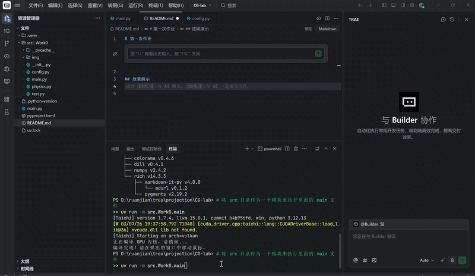

# 第一次作业

## 效果演示



## 项目架构

本项目采用模块化设计，主要包含以下文件：

- `src/Work0/main.py`：项目主入口，负责初始化和运行整个程序
- `src/Work0/config.py`：存储项目配置参数，如粒子数量、引力强度等
- `src/Work0/physics.py`：实现物理计算逻辑，包括粒子的初始化和更新
- `src/Work0/img/yanshi.gif`：演示效果图片

## 代码逻辑

1. **初始化**：
   - 使用 Taichi 库初始化 GPU 环境
   - 从 config.py 导入配置参数
   - 从 physics.py 导入物理计算相关函数

2. **物理计算**：
   - 在显存中创建粒子的位置和速度字段
   - 初始化粒子的随机位置
   - 主循环中，根据鼠标位置计算粒子受到的引力
   - 应用空气阻力和边界碰撞检测

3. **渲染**：
   - 创建 GUI 窗口
   - 实时渲染粒子的位置
   - 响应用户的鼠标移动

## 实现功能

- **粒子系统模拟**：模拟大量粒子的运动
- **鼠标交互**：粒子会受到鼠标的引力，跟随鼠标移动
- **物理碰撞检测**：粒子碰到边界时会反弹
- **GPU 加速**：使用 Taichi 库进行 GPU 并行计算，提高性能
- **实时渲染**：实时显示粒子的运动状态

## 运行方式

在项目根目录下运行：

```bash
python src/Work0/main.py
```

运行后会弹出一个窗口，移动鼠标可以观察粒子的运动效果。